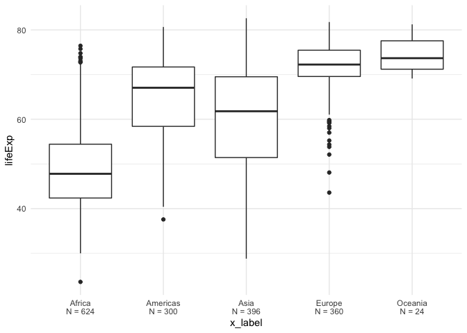

<!-- README.md is generated from README.Rmd. Please edit that file -->

# statsummary

<!-- badges: start -->
<!-- badges: end -->

The goal of statsummary is to compute summary statistics (mean, median,
minimum, maximum, count) on a numeric variable grouped by a categorical
variable.

## Installation

statsummary is not yet on CRAN. You can install the development version
of statsummary like so:

``` r
devtools::install_github("eamutaigwe/statsummary")
```

## Example

Summarize_data() is a function that helps to carry out a fairly common
task on a dataset which quickly computes summary statistics (mean,
median, minimum, maximum, and count) on a numeric variable grouped by a
categorical variable.

It also produces a ggplot object- boxplot which visually presents all
the summary statistics found in the summary table.

Below is a basic example which shows you how to use the function:

``` r
library(statsummary)
summarize_data(gapminder::gapminder, continent, lifeExp)
#> [[1]]
#> # A tibble: 5 × 6
#>   continent  mean median   min   max     n
#>   <fct>     <dbl>  <dbl> <dbl> <dbl> <int>
#> 1 Africa     48.9   47.8  23.6  76.4   624
#> 2 Americas   64.7   67.0  37.6  80.7   300
#> 3 Asia       60.1   61.8  28.8  82.6   396
#> 4 Europe     71.9   72.2  43.6  81.8   360
#> 5 Oceania    74.3   73.7  69.1  81.2    24
#> 
#> [[2]]
#> Warning: Removed 5 rows containing missing values (geom_segment).
```


